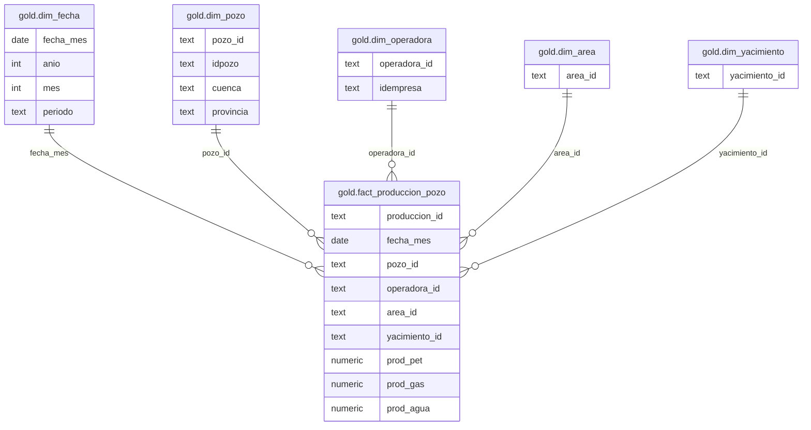

# Modelo de datos analítico

El modelo sigue una arquitectura por capas: Bronze, Silver, Gold y Semantic.

## Silver

Silver toma los datos crudos de Bronze y los deja limpios, tipados y trazables.

Tablas principales:
- silver.produccion_no_convencional
- silver.pozos_operadoras

En Silver se convierten fechas, números y textos. También se conserva metadata como _run_id, _source_file_hash e _ingested_at.

## Gold

Gold usa un modelo estrella para análisis.

Tabla de hechos principal:
- gold.fact_produccion_pozo

Grano de la fact table:
- una fila por registro de producción de un pozo en un período mensual.

Medidas principales:
- prod_pet
- prod_gas
- prod_agua
- iny_agua
- iny_gas
- iny_co2
- iny_otro
- tef
- vida_util

Dimensiones principales:
- gold.dim_fecha
- gold.dim_pozo
- gold.dim_operadora
- gold.dim_area
- gold.dim_yacimiento

### Diagrama estrella

## Surrogate keys

Las claves surrogate se generan con md5 sobre identificadores naturales de la fuente.

Ejemplos:
- pozo_id desde idpozo
- operadora_id desde idempresa
- area_id desde idareapermisoconcesion
- yacimiento_id desde idareayacimiento

## SCD

Se usa SCD tipo 1 para dim_pozo, dim_operadora, dim_area y dim_yacimiento.

La decisión se toma porque la fuente no garantiza una historia confiable de cambios de atributos. Usar SCD tipo 2 en esta fase sería sobreingeniería.

## Semantic

La capa Semantic expone vistas SQL listas para BI:
- semantic.vw_produccion_mensual
- semantic.vw_produccion_por_operadora
- semantic.vw_produccion_por_area
- semantic.vw_frescura_datos

## Métricas BI

Métricas principales:
- producción mensual total
- producción por operadora
- producción por área y yacimiento
- cantidad de pozos con producción
- última ingesta disponible
- último período disponible
